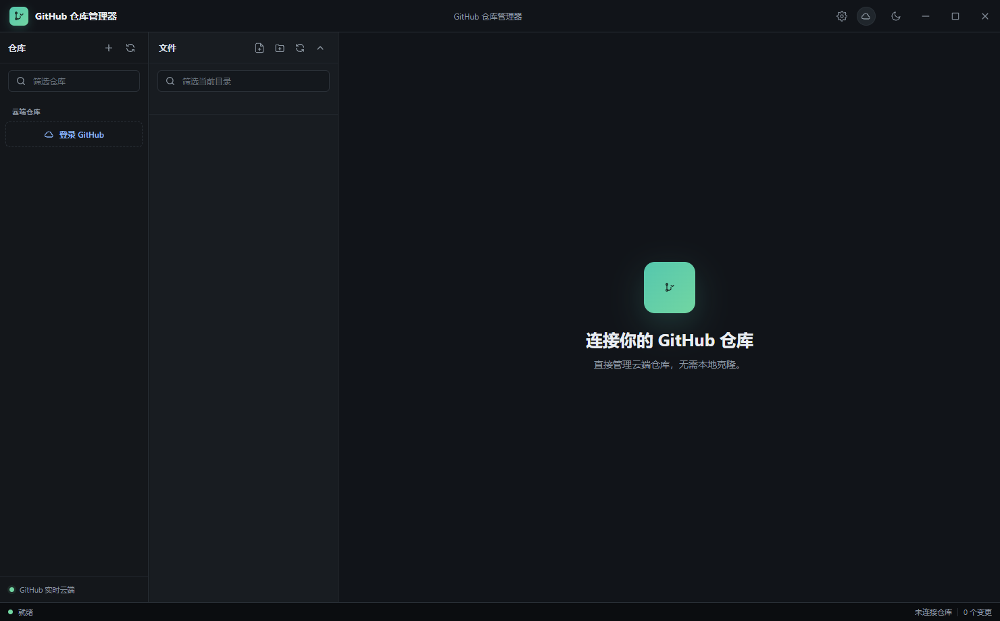

# GitHub Repository Manager

> Professional GitHub repository manager for the desktop. Browse, edit, upload, download, and manage GitHub repositories directly from the cloud without maintaining a local clone.


## Features

| Category | Capabilities |
| --- | --- |
| Cloud First | No local repository required; every change is committed directly to GitHub |
| Authentication | GitHub personal access token, stored with Electron `safeStorage` |
| Repositories | Browse, search, create with a GitHub web-style form, edit description and visibility |
| Branching | Switch branches and refresh files, README, commits, and search index together |
| File Explorer | GitHub-style single-column list, breadcrumbs, folder expansion, drag-and-drop upload |
| File Operations | Create, rename, duplicate, delete, copy path, copy web link, copy raw link |
| Download | Single file, folder, full repository, and ZIP download |
| Editor | Text editing with line numbers, image preview, binary detection, README Markdown preview |
| Repository Overview | Description, language, stars, forks, visibility, README, recent commits, branches |
| Search | Current-directory filtering and whole-repository tree search |
| Stability | Operation lock with spinner; cloud tree is polled until the write is confirmed |
| Design | Dark and light themes, resizable panels, native-style window controls |
| Language | English by default; switch to Chinese from Settings |

## Screenshots



## Getting Started

### Prerequisites

- Node.js 22 or newer
- npm
- A GitHub personal access token with repository read/write permissions

### Install

```bash
npm install
```

### Run

```bash
npm start
```

You can also double-click the desktop shortcut or run `Start-Repo-Studio.bat` / `Start-Repo-Studio.ps1`.

### Connect GitHub

1. Open GitHub settings and create a personal access token.
2. For a classic token, select the `repo` scope.
3. For a fine-grained token, grant `Contents: Read and write` on the target repositories.
4. Open GitHub Repository Manager, click the account button, paste the token, and log in.

The token is encrypted by the operating system keychain integration and is only used in the Electron main process.

## Usage

### Repositories

- Click a repository in the sidebar to open it in cloud mode.
- Use the sidebar search box to filter repositories by owner, name, language, or description.
- Right-click a repository to open GitHub, download ZIP, edit information, or copy clone addresses.
- Click the plus button in the sidebar to create a repository with owner, name, description, public/private visibility, README, `.gitignore`, and license options, just like the GitHub web page.
- Open Settings from the title bar and choose English or 中文 for the interface language.

### File Browser

- Use the branch selector to switch branches.
- Click a folder to enter it, or click a breadcrumb segment to jump back.
- Type in the search box to filter the current directory.
- Click the whole-repository search button to search all files in the current branch.
- Drag files or folders from Explorer into the window to upload them to the current directory.

### File Operations

Right-click any file or folder for:

- Open and edit
- Download
- Open in GitHub
- View history
- Rename, duplicate, delete
- Copy path, web link, or raw link

All destructive operations ask for confirmation. Every write shows a spinner and waits for GitHub to confirm the new cloud state before the next action is allowed.

## Keyboard Shortcuts

| Shortcut | Action |
| --- | --- |
| `Ctrl+S` | Save current file |
| `Ctrl+F` | Focus file search |
| `Ctrl+N` | New file |
| `Ctrl+Shift+N` | New folder |
| `Ctrl+Shift+R` | Refresh current directory |
| `Ctrl+,` | Toggle dark/light theme |

## Architecture

```
electron/
├── main.js          # GitHub API, secure token storage, downloads, IPC handlers
├── preload.js       # Restricted contextBridge API for the renderer
└── renderer/
    ├── index.html   # Application shell
    ├── app.js       # Cloud UI, editor, overview, branch and search logic
    ├── styles.css   # Dark/light theme and layout system
    └── icons.js     # Inline SVG icon set
```

The main process owns GitHub authentication and file-system access. The renderer only talks to GitHub through the preload bridge, so privileged APIs are never exposed directly to the page.

## Configuration

Application data is stored under the system app-data directory:

```text
%APPDATA%/Repo Studio
```

This directory contains the encrypted GitHub token and any optional local repository metadata. Theme and panel widths are saved in the renderer's local storage.

## Requirements

- Windows 10 or newer
- GitHub personal access token
- Network access to `api.github.com` and `github.com`

## Contributing

Contributions are welcome:

1. Fork the repository.
2. Create a feature branch: `git checkout -b feature/my-feature`.
3. Commit your changes.
4. Push and open a pull request.

## License

This project is licensed under the MIT License.
